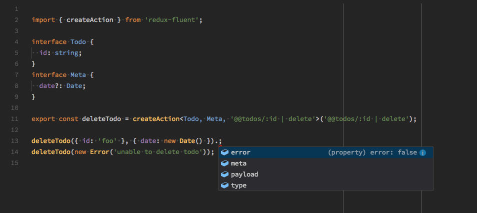

# Action

1. a ***redux-fluent Action*** is a [Flux Standard Action](https://github.com/acdlite/flux-standard-action).
2. a ***redux-fluent Action*** represents all the concepts of Action, Action Type, Action Creator.

## Signature

```typescript
/**
 * @param {string} type
 * @param {(rawPayload) => payload} [payloadCreator = null]
 * @param {(rawMeta) => meta} [metaCreator = null]
 *
 * @return {(payload, meta) => Flux Standard Action} - Action Creator
**/
function createAction(type, payloadCreator?, metaCreator?) { /* ... */ };

/**
 * @param {object | Error} [payload = null]
 * @param {object} [meta = null]
 *
 * @return { type: string, error: boolean, meta, payload } Flux Standard Action
**/
function actionCreator(payload?, meta?) { /* ... */ }
```

## Anatomy
The ***Action Type*** is a `string` representing a **path** to an entity and a **pipe** of operations, it can eventually start with `@@` whenever the entity is being held by the store (`path/to/entity | op1 | op2 | opN`):

```typescript
import { createAction } from 'redux-fluent';

/**
 * @description DELETE FROM state.todos WHERE id = action.payload.id
 *
 * @param {{ id: string }} [payload = null]
 * @param {object} [meta = null]
*/
export const deleteTodo = createAction('@@todos/:id | delete');
```

- The ***Action Creator*** is a `function` being returned by `createAction`

```typescript
// DELETE FROM state.todos WHERE id = 'foo'
deleteTodo({ id: 'foo' });

{
  type: '@@todos/:id | delete',
  payload: { id: 'foo' },
  error: false,
  meta: null,
}
```

- The `actionCreator` also takes a second parameter representing the **Action Meta**:

```typescript
deleteTodo({ id: 'foo' }, { date: new Date() });

{
  type: '@@todos/:id | delete',
  payload: { id: 'foo' },
  error: false,
  meta: { date: 'Mon Jan 22 2018 12:04:18 GMT+0000 (GMT)' },
}
```

- The Action is an ***Error Action*** whenever the first argument is an `instanceof Error`

```typescript
deleteTodo(new Error('unable to delete todo'), { date: new Date() });

{
  type: '@@todos/:id | delete',
  payload: Error,
  error: true,
  meta: { date: 'Mon Jan 22 2018 12:04:18 GMT+0000 (GMT)' },
}
```

- The `actionCreator` always gives access to its `type`:

```typescript
deleteTodo.type; // @@todos/:id | delete
deleteTodo.toString(); // @@todos/:id | delete
`${deleteTodo}`; // @@todos/:id | delete
```

## Real Life Example

```typescript
// ./store/todos.js

import { createAction } from 'redux-fluent';

export const deleteTodo = createAction('@@todos/:id | delete');
```

```javascript
// TodoComponent.jsx

import React, { PureComponent } from 'react';
import { connect } from 'react-redux';
import PropTypes from 'prop-types';
import { deleteTodo } from './store/todos';

export class TodoComponent extends PureComponent {
  static propTypes = {
    dispatchDeleteTodo: PropTypes.func.isRequired,
    id: PropTypes.string.isRequired,
  };

  deleteTodo = () => this.props.dispatchDeleteTodo({
    id: this.props.id,
  });

  render() {
    return(
      <button onClick={this.deleteTodo}>Delete Todo</button>
    );
  }
}

const mapStateToProps = () => ({
  id: 'foo',
});

const mapDispatchToProps = {
  dispatchDeleteTodo: deleteTodo,
};

export default connect(mapStateToProps, mapDispatchToProps)(TodoComponent);
```

## Usage with Typescript


